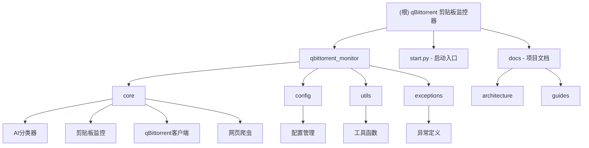

# qBittorrent 剪贴板监控与自动分类下载器

## 变更记录 (Changelog)

- **2025-10-22**: 完成全项目文件扫描，已生成完整模块文档和导航面包屑系统
- **2025-10-22**: 初始化 AI 上下文文档，完成项目架构分析和模块结构梳理
- **2025-08-17**: v2.1.0 项目清理和README重写，修复资源泄漏问题
- **2025-07-15**: v2.0.0 重大性能优化，磁力链接提取速度提升2-3倍

## 项目愿景

🚀 **智能磁力链接监控与自动分类下载工具** - 打造最智能化的种子下载管理助手，集成 AI 分类、网页爬虫和自动化管理，让数字内容下载变得简单而高效。

## 架构总览

### 核心架构
- **异步驱动**: 基于 asyncio 的高性能异步架构
- **模块化设计**: 清晰的职责分离，易于维护和扩展
- **AI 智能分类**: 集成 DeepSeek AI 模型进行精准内容分类
- **网页爬虫**: 基于 crawl4ai 的专业网页内容抓取
- **配置管理**: 支持热加载、多格式、环境变量覆盖
- **通知系统**: 多渠道通知集成

### 技术栈
- **语言**: Python 3.9+
- **AI 模型**: DeepSeek, OpenAI GPT
- **爬虫框架**: crawl4ai
- **HTTP 客户端**: aiohttp
- **配置管理**: Pydantic + Dynaconf
- **Web 服务**: FastAPI (可选)

## 模块结构图



## 模块索引

| 模块路径 | 职责描述 | 入口文件 | 文档状态 | 测试状态 |
|---------|---------|---------|---------|---------|
| `start.py` | 应用程序启动入口，依赖检查和初始化 | `main()` | ✅ 已分析 | 🔄 需要测试 |
| `qbittorrent_monitor/` | 核心业务逻辑包 | `__init__.py` | ✅ 已分析 | 🔄 需要测试 |
| `qbittorrent_monitor/config.py` | 配置管理，支持热加载和多格式 | `ConfigManager` | ✅ 已分析 | ✅ 验证完整 |
| `qbittorrent_monitor/clipboard_monitor.py` | 剪贴板监控和内容检测 | `ClipboardMonitor` | ✅ 已分析 | 🔄 需要测试 |
| `qbittorrent_monitor/qbittorrent_client.py` | qBittorrent API 客户端 | `QBittorrentClient` | ✅ 已分析 | 🔄 需要测试 |
| `qbittorrent_monitor/ai_classifier.py` | AI 智能分类器 | `AIClassifier` | ✅ 已分析 | 🔄 需要测试 |
| `qbittorrent_monitor/web_crawler.py` | 网页爬虫和种子批量下载 | `WebCrawler` | ✅ 已分析 | 🔄 需要测试 |
| `qbittorrent_monitor/utils.py` | 通用工具函数 | 多个工具函数 | ✅ 已分析 | 🔄 需要测试 |
| `qbittorrent_monitor/exceptions.py` | 自定义异常类定义 | 异常类层次 | ✅ 已分析 | 🔄 需要测试 |
| `qbittorrent_monitor/performance_monitor.py` | 性能监控和指标收集 | `PerformanceMonitor` | ✅ 已分析 | 🔄 需要测试 |
| `qbittorrent_monitor/log_optimizer.py` | 日志优化和结构化日志 | `LogOptimizer` | ✅ 已分析 | 🔄 需要测试 |
| `qbittorrent_monitor/main.py` | 主应用程序类 | `QBittorrentDownloadHelper` | ✅ 已分析 | 🔄 需要测试 |
| `docs/` | 项目文档和指南 | `README.md` | ✅ 已分析 | ✅ 文档完整 |

## 运行与开发

### 快速启动
```bash
# 安装依赖
pip install -r requirements.txt

# 启动监控
python start.py

# 查看帮助
python start.py --help
```

### 开发模式
```bash
# 安装开发依赖
pip install -r requirements-dev.txt

# 代码格式化
black qbittorrent_monitor/

# 类型检查
mypy qbittorrent_monitor/

# 运行测试（当测试文件存在时）
pytest tests/
```

## 测试策略

### 当前测试状态
- ❌ **单元测试**: 缺失（需要补充）
- ❌ **集成测试**: 缺失（需要补充）
- ❌ **性能测试**: 缺失（需要补充）
- ❌ **端到端测试**: 缺失（需要补充）

### 建议测试覆盖
1. **配置管理测试**: 验证配置加载、验证、热加载
2. **AI分类器测试**: Mock AI API，测试分类逻辑
3. **剪贴板监控测试**: 测试内容检测和重复处理
4. **qBittorrent客户端测试**: Mock API，测试连接和操作
5. **网页爬虫测试**: Mock crawl4ai，测试爬取逻辑
6. **异常处理测试**: 测试各种错误场景
7. **性能测试**: 测试并发处理和资源管理

## 编码规范

### 代码风格
- **格式化**: Black (line-length=100)
- **类型检查**: mypy (严格模式)
- **代码质量**: flake8
- **文档**: 所有公共 API 需要有详细文档字符串

### 命名约定
- **类名**: PascalCase (如 `ClipboardMonitor`)
- **函数名**: snake_case (如 `get_torrent_info`)
- **常量**: UPPER_SNAKE_CASE (如 `DEFAULT_TIMEOUT`)
- **文件名**: snake_case (如 `ai_classifier.py`)

### 异步编程
- 使用 `async/await` 而非回调
- 合理使用 `asyncio.Lock()` 避免竞态条件
- 错误处理使用 `try/except` 包裹异步操作
- 资源清理使用 `async with` 上下文管理器

### 日志规范
- 使用结构化日志格式
- 日志级别: DEBUG < INFO < WARNING < ERROR
- 敏感信息（如 API 密钥）不得记录到日志中
- 性能关键路径添加详细的时间戳

## AI 使用指引

### AI 模型集成
- **主要模型**: DeepSeek (deepseek-chat)
- **备用模型**: OpenAI GPT 系列
- **分类策略**: Few-shot 学习 + 关键词规则回退
- **缓存机制**: 24小时 LRU 缓存，避免重复调用

### 分类提示词优化
- 详细的分类描述和关键词提示
- Few-shot 示例提供分类参考
- 处理边界情况和歧义内容
- 支持自定义分类规则和优先级

### 性能优化
- 请求速率限制避免 API 配额耗尽
- 指数退避重试机制
- 本地缓存减少 API 调用
- 并发请求控制

## 关键依赖

### 核心依赖
- `aiohttp`: 异步 HTTP 客户端
- `pydantic`: 数据验证和设置管理
- `pyperclip`: 剪贴板访问
- `openai`: AI 模型 API 客户端
- `crawl4ai`: 网页爬虫框架

### 开发依赖
- `pytest`: 测试框架
- `black`: 代码格式化
- `mypy`: 类型检查
- `flake8`: 代码质量检查

## 部署与运维

### 环境要求
- Python 3.9+
- qBittorrent Web UI 已启用
- 网络连接（用于 AI 分类和网页爬取）

### 配置管理
- 支持环境变量覆盖配置
- 配置文件热重载
- 多环境配置模板（开发/生产/测试）
- 配置验证和错误提示

### 监控和日志
- 结构化日志输出
- 性能指标监控
- 错误统计和报告
- 资源使用情况跟踪

## 常见问题解决

### 配置相关
1. **qBittorrent 连接失败**: 检查 Web UI 是否启用，网络是否通畅
2. **AI 分类不工作**: 验证 API 密钥，检查网络连接
3. **剪贴板监控异常**: 确保系统剪贴板服务正常

### 性能相关
1. **内存使用过高**: 检查缓存配置，定期清理历史记录
2. **CPU 占用过高**: 调整监控间隔，优化正则表达式
3. **网络请求频繁**: 启用缓存，调整重试策略

### 功能相关
1. **分类不准确**: 调整 AI 提示词，增加关键词规则
2. **网页爬取失败**: 检查目标网站可访问性，调整 User-Agent
3. **种子下载失败**: 验证 qBittorrent 配置，检查磁盘空间

## 贡献指南

### 开发流程
1. Fork 项目并创建功能分支
2. 编写代码并添加测试
3. 运行代码质量检查
4. 提交 Pull Request

### 代码提交规范
```
type(scope): description

[optional body]

[optional footer]
```

类型：feat, fix, docs, style, refactor, test, chore

### 文档维护
- 新功能需要更新相关文档
- API 变更需要更新接口文档
- 配置变更需要更新配置示例

---

**注意**: 这是一个活跃开发中的项目，建议定期查看更新日志和文档变更。