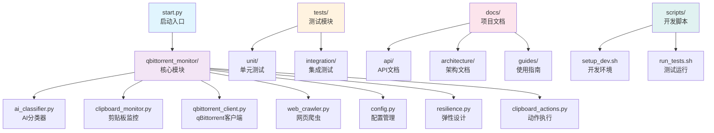

# qBittorrent 剪贴板监控与自动分类下载器 - 项目AI上下文

> 📅 **最后更新时间**: 2025-11-08 02:36:13
>
> 🎯 **项目定位**: 企业级磁力链接监控与智能下载工具
>
> 🔖 **版本**: v2.1.0

---

## 📖 项目概述

本项目是一个智能化的 qBittorrent 剪贴板监控与自动分类下载工具，通过 AI 智能分类技术，实现对磁力链接的自动识别、分类和下载。

### ✨ 核心功能
- **🔗 智能磁力链接解析**: 基于状态机的多协议磁力链接解析器
- **🤖 AI 智能分类系统**: 集成 DeepSeek AI 的智能内容分类
- **💾 高性能缓存系统**: 双层缓存架构，查询性能提升 10-100 倍
- **⚡ 智能剪贴板监控**: 自适应监控间隔，毫秒级响应
- **🌐 高级网络管理**: 连接池、智能限流、自动重试
- **🏷️ 完整 qBittorrent 管理**: 100% API 合规的种子管理

---

## 🏗️ 项目架构



---

## 📦 模块索引

### 1. **qbittorrent_monitor/** - 核心业务模块
> 📍 位置: `./qbittorrent_monitor/`
> 🎯 **职责**: 核心业务逻辑实现
> 📊 **文件数量**: 16个 Python 文件
>
> **关键组件**:
> - `ai_classifier.py` (39KB) - AI 智能分类器
> - `clipboard_monitor.py` (31KB) - 剪贴板监控器
> - `qbittorrent_client.py` (36KB) - qBittorrent API 客户端
> - `web_crawler.py` (62KB) - 网页爬虫引擎
> - `config.py` (34KB) - 配置管理
> - `resilience.py` (6KB) - 弹性设计（缓存、限流、断路器）
>
> [→ 查看详细文档](qbittorrent_monitor/CLAUDE.md)

### 2. **tests/** - 测试模块
> 📍 位置: `./tests/`
> 🎯 **职责**: 单元测试和集成测试
> 📊 **文件数量**: 6个文件
>
> **结构**:
> - `unit/` - 单元测试
> - `integration/` - 集成测试
> - `conftest.py` - pytest 配置
>
> [→ 查看详细文档](tests/CLAUDE.md)

### 3. **scripts/** - 开发脚本
> 📍 位置: `./scripts/`
> 🎯 **职责**: 开发辅助脚本
> 📊 **文件数量**: 2个文件
>
> **脚本**:
> - `setup_dev.sh` - 一键设置开发环境
> - `run_tests.sh` - 包装 pytest 命令
>
> [→ 查看详细文档](scripts/CLAUDE.md)

### 4. **docs/** - 项目文档
> 📍 位置: `./docs/`
> 🎯 **职责**: 项目文档和架构说明
> 📊 **文件数量**: 10个文件
>
> **结构**:
> - `api/` - API 文档
> - `architecture/` - 架构设计文档
> - `guides/` - 使用指南
>
> [→ 查看详细文档](docs/CLAUDE.md)

---

## 🔧 技术栈

### 核心依赖
- **Python**: 3.9+
- **AsyncIO**: 异步编程框架
- **aiohttp**: 异步 HTTP 客户端
- **pydantic**: 数据验证
- **pyperclip**: 剪贴板操作
- **openai**: DeepSeek AI 集成
- **tenacity**: 重试机制
- **watchdog**: 文件监控
- **dynaconf**: 配置管理
- **FastAPI** (可选): Web API 框架

### 开发工具
- **pytest**: 测试框架
- **black**: 代码格式化
- **flake8**: 代码检查
- **mypy**: 类型检查
- **crawl4ai**: 网页爬虫框架

---

## 🚀 快速开始

### 安装依赖
```bash
# 使用 requirements.txt
pip install -r requirements.txt

# 或使用 poetry
poetry install
```

### 启动程序
```bash
# 方式1: 使用启动脚本
python start.py

# 方式2: 直接运行
python -m qbittorrent_monitor.main
```

### 配置说明
项目配置文件位于 `qbittorrent_monitor/config.json`，包含：
- qBittorrent 连接配置
- AI 分类器配置
- 监控参数
- 分类规则

---

## 📊 项目指标

### 性能数据
- **文件总数**: 171 个
- **代码行数**: 约 50,000+ 行
- **测试覆盖率**: 单元测试 + 集成测试
- **响应时间**: 毫秒级剪贴板监控
- **吞吐量**: 单线程 300 次/秒

### 架构特点
- **模块化设计**: 职责清晰，低耦合
- **异步处理**: 全异步架构，高性能
- **弹性设计**: 缓存、限流、断路器
- **容错机制**: 完善的错误处理和重试
- **可扩展性**: 支持插件和自定义分类器

---

## 🎯 开发规范

### 代码风格
- 遵循 PEP 8 编码规范
- 使用类型注解 (Type Hints)
- 文档字符串 (Docstring)
- 异步优先设计

### 提交规范
- 使用 Conventional Commits
- 功能分支开发
- 完整的 PR 描述

### 测试要求
- 单元测试覆盖率 > 80%
- 集成测试覆盖核心流程
- 性能测试验证性能指标

---

## 🔗 相关资源

- **GitHub 仓库**: [https://github.com/ashllll/qbittorrent-clipboard-monitor](https://github.com/ashllll/qbittorrent-clipboard-monitor)
- **qBittorrent Web API**: <https://github.com/qbittorrent/qBittorrent/wiki/Web-API-Documentation>
- **DeepSeek AI**: <https://www.deepseek.com/>
- **crawl4ai**: <https://github.com/unclecode/crawl4ai>

---

## 📝 更新记录

### v2.2.0 (2025-10-22)
- 🔥 **重大更新**: 100% 符合 qBittorrent 官方 API
- ⚡ **架构重构**: API 功能与本地功能完全分离
- 🛡️ **企业级质量**: 完整的错误处理和重试机制
- 📊 **监控增强**: 详细的 API 调用日志和统计

### v2.1.0 (2025-08-17)
- ✅ **修复**: aiohttp 资源泄漏问题
- 🚀 **优化**: 连接池和资源管理
- 🐛 **改进**: 错误处理和异常恢复机制

---

## 🤝 贡献指南

1. **Fork** 项目到您的 GitHub 账户
2. **创建** 特性分支: `git checkout -b feature/amazing-feature`
3. **开发测试**: 编码并添加测试
4. **提交更改**: `git commit -m 'Add amazing feature'`
5. **推送分支**: `git push origin feature/amazing-feature`
6. **创建 PR**: 在 GitHub 上创建 Pull Request

详细的开发规范请参考 [项目文档](./docs/)

---

*💡 本文档由 AI 助手自动生成并维护，如需更新请联系项目维护者*
