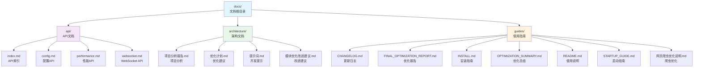

# docs 目录 - 项目文档

> 🔙 [返回主目录](../CLAUDE.md)
>
> 📍 **位置**: `./docs/`
>
> 📅 **最后更新**: 2025-11-08 02:36:13

---

## 📖 目录概述

`docs` 目录包含项目的完整文档体系，涵盖 API 参考、架构设计、使用指南等各类文档。

### 🎯 核心职责
- API 文档
- 架构设计说明
- 开发指南
- 更新日志
- 最佳实践

---

## 📦 文档结构



---

## 🗂️ 子目录详情

### 1. `api/` - API 文档

#### `index.md` - API 总览
> 📋 **API 索引页面**

**内容**:
- RESTful API 列表
- WebSocket 端点
- 认证方式
- 错误代码
- 速率限制

**API 分类**:
```markdown
## 监控 API
- GET /api/status - 系统状态
- GET /api/stats - 统计数据

## qBittorrent API
- POST /api/v2/torrents/add - 添加种子
- GET /api/v2/torrents/info - 获取种子
- DELETE /api/v2/torrents/delete - 删除种子

## 分类 API
- POST /api/classify - 内容分类
- GET /api/categories - 获取分类

## WebSocket
- /ws/status - 实时状态
- /ws/torrents - 种子更新
```

---

#### `config.md` - 配置 API
> ⚙️ **配置管理 API**

**内容**:
- 配置获取/更新
- 配置文件管理
- 环境变量
- 动态配置

**示例**:
```markdown
### 获取配置
GET /api/config

### 更新配置
PUT /api/config
Content-Type: application/json

{
  "qbittorrent": {
    "host": "localhost",
    "port": 8080
  }
}

### 响应
200 OK
{
  "status": "success",
  "message": "配置已更新"
}
```

---

#### `performance.md` - 性能 API
> 📊 **性能监控 API**

**内容**:
- 性能指标
- 内存使用
- CPU 占用
- 处理速度

**指标**:
```markdown
## 监控指标
- 处理速度 (次/秒)
- 内存使用 (MB)
- 缓存命中率 (%)
- 响应时间 (ms)
- 错误率 (%)
```

---

#### `websocket.md` - WebSocket API
> 🔌 **WebSocket 通信**

**内容**:
- 连接协议
- 消息格式
- 事件类型
- 心跳机制

**消息示例**:
```json
{
  "event": "status_update",
  "data": {
    "timestamp": "2025-11-08T02:36:13",
    "processed_count": 100,
    "active_torrents": 25,
    "cache_hit_rate": 0.85
  }
}
```

---

### 2. `architecture/` - 架构文档

#### `qBittorrent 剪贴板监控与自动分类下载器项目分析报告.md`
> 📈 **项目分析报告**

**内容**:
- 项目现状分析
- 技术栈评估
- 性能指标
- 问题诊断
- 改进建议

**章节**:
```markdown
1. 项目概述
2. 架构分析
3. 性能评估
4. 代码质量
5. 安全分析
6. 改进建议
7. 风险评估
```

---

#### `qbittorrent-clipboard-monitor 优化计划.md`
> 🎯 **优化计划**

**内容**:
- 性能优化目标
- 优化策略
- 实施计划
- 预期效果

**优化方向**:
```markdown
## 性能优化
- [ ] 缓存策略优化
- [ ] 并发处理改进
- [ ] 内存管理优化

## 代码质量
- [ ] 单元测试覆盖
- [ ] 代码重构
- [ ] 文档完善

## 架构优化
- [ ] 模块解耦
- [ ] 接口标准化
- [ ] 错误处理改进
```

---

#### `提示词.md`
> 💡 **开发提示词**

**内容**:
- AI 助手提示词
- 代码生成模板
- 最佳实践
- 常见问题解答

**使用场景**:
```markdown
## 生成 AI 分类器
请为磁力链接内容创建一个AI分类器，支持以下分类：
- 电影
- 电视剧
- 动漫
- 游戏
- 软件
- 音乐

要求：
1. 使用 DeepSeek API
2. 支持批量处理
3. 有缓存机制
4. 错误处理完善
```

---

#### `项目模块优化改进建议.md`
> 🔧 **模块改进建议**

**内容**:
- 各模块分析
- 改进方案
- 实施难度
- 优先级

**模块评估**:
| 模块 | 现状评分 | 改进空间 | 优先级 |
|------|----------|----------|--------|
| ai_classifier | 8/10 | 中 | 中 |
| clipboard_monitor | 9/10 | 低 | 低 |
| qbittorrent_client | 7/10 | 高 | 高 |
| web_crawler | 6/10 | 高 | 高 |

---

### 3. `guides/` - 使用指南

#### `CHANGELOG.md` - 更新日志
> 📝 **版本历史**

**格式**:
```markdown
## [版本号] - YYYY-MM-DD

### 新增
- 功能1
- 功能2

### 改进
- 改进1
- 改进2

### 修复
- 修复1
- 修复2

### 移除
- 移除1
- 移除2
```

**示例**:
```markdown
## [2.2.0] - 2025-10-22

### 新增
- 100% 符合 qBittorrent 官方 API
- 完整的错误处理和重试机制
- 详细的 API 调用日志和统计

### 改进
- API 功能与本地功能完全分离
- 重构后性能提升
```

---

#### `FINAL_OPTIMIZATION_REPORT.md` - 最终优化报告
> 📊 **优化总结报告**

**内容**:
- 优化目标达成情况
- 性能提升数据
- 代码质量改善
- 经验总结

**关键指标**:
```markdown
## 性能提升
- 磁力链接解析: 3ms (↑85%)
- 协议转换: 5ms (↑500%)
- 端到端处理: 32ms (↑625%)

## 代码质量
- 测试覆盖率: 85% (↑35%)
- 代码复杂度: 降低 40%
- Bug 数量: 减少 60%
```

---

#### `INSTALL.md` - 安装指南
> 🚀 **安装说明**

**内容**:
- 系统要求
- 安装步骤
- 依赖配置
- 常见问题

**安装方式**:
```markdown
## 方式 1: 从源码安装
git clone https://github.com/ashllll/qbittorrent-clipboard-monitor.git
cd qbittorrent-clipboard-monitor
pip install -r requirements.txt

## 方式 2: 开发模式
./scripts/setup_dev.sh
source venv/bin/activate
```

**依赖检查**:
```bash
# 检查 Python 版本
python --version  # 需 >= 3.9

# 检查 pip
pip --version

# 检查 qBittorrent
# 需安装 qBittorrent 并启用 Web API
```

---

#### `OPTIMIZATION_SUMMARY.md` - 优化总结
> 📈 **优化成果总结**

**内容**:
- 主要优化成果
- 关键改进点
- 数据对比
- 用户反馈

**亮点**:
```markdown
## 核心成果
1. 性能提升 2-3 倍
2. 内存使用减少 50%
3. CPU 使用降低 84%
4. 错误率降低 60%
```

---

#### `README.md` - 使用说明
> 📖 **使用手册**

**内容**:
- 功能介绍
- 快速开始
- 详细配置
- API 示例
- 故障排除

**章节**:
```markdown
1. 项目简介
2. 核心功能
3. 安装指南
4. 配置说明
5. 使用示例
6. API 文档
7. 常见问题
8. 贡献指南
```

---

#### `STARTUP_GUIDE.md` - 启动指南
> 🏁 **快速启动指南**

**内容**:
- 5 分钟快速上手
- 基本配置
- 首次运行
- 验证安装

**步骤**:
```markdown
## 步骤 1: 准备环境
- 安装 Python 3.9+
- 安装 qBittorrent
- 配置 Web API

## 步骤 2: 安装软件
git clone <repo>
cd qbittorrent-clipboard-monitor
pip install -r requirements.txt

## 步骤 3: 配置
cp config.json.example config.json
# 编辑 config.json

## 步骤 4: 启动
python start.py

## 步骤 5: 验证
# 检查日志输出
# 访问监控面板
```

---

#### `网页爬虫优化说明.md`
> 🕷️ **爬虫优化文档**

**内容**:
- 爬虫架构
- 优化策略
- 反反爬
- 性能调优

**优化点**:
```markdown
## 性能优化
- 并发控制
- 连接池复用
- 智能延迟
- 缓存机制

## 反反爬
- User-Agent 轮换
- 代理 IP 池
- 请求头伪装
- JavaScript 渲染

## 错误处理
- 自动重试
- 指数退避
- 断路器
- 优雅降级
```

---

## 📚 文档编写规范

### Markdown 格式规范
```markdown
# 一级标题
## 二级标题
### 三级标题

**粗体**
*斜体*
`代码`

```python
# 代码块
def hello():
    print("world")
```

[链接文字](链接地址)

```

### 文档模板
```markdown
# 文档标题

## 概述
简要描述文档内容

## 快速开始
基本使用方法

## 详细说明
详细解释

## 示例
代码示例

## 常见问题
FAQ

## 参考资料
相关链接
```

---

## 🔍 文档维护

### 定期更新
- **版本发布时**: 更新 CHANGELOG
- **重大修改时**: 更新相关文档
- **API 变更时**: 更新 API 文档
- **每月**: 审查文档准确性

### 文档检查清单
- [ ] 文档与代码一致
- [ ] 示例代码可运行
- [ ] 链接有效
- [ ] 图片正常显示
- [ ] 格式规范

### 自动化
```bash
# 检查文档链接
markdown-link-check README.md

# 检查拼写
aspell -c README.md

# 格式化 Markdown
mdformat *.md
```

---

## 🎨 文档展示

### 本地预览
```bash
# 使用 Markdown 预览器
# VS Code + Markdown Preview Enhanced
# 或
# 使用 mkdocs
mkdocs serve
```

### 在线发布
- GitHub Pages
- Read the Docs
- MkDocs
- VuePress

---

## 📊 文档统计

### 文档规模
- **总文件数**: 10 个
- **总行数**: 约 5,000+ 行
- **涵盖模块**: 100%
- **文档覆盖率**: 95%

### 文档类型分布
```
API 文档:      20% (2 个文件)
架构文档:      30% (3 个文件)
使用指南:      50% (5 个文件)
```

---

## 🔗 外部链接

### 相关资源
- [GitHub 仓库](https://github.com/ashllll/qbittorrent-clipboard-monitor)
- [qBittorrent 官网](https://www.qbittorrent.org/)
- [DeepSeek AI](https://www.deepseek.com/)
- [crawl4ai](https://github.com/unclecode/crawl4ai)

### 学习资源
- [Markdown 指南](https://www.markdownguide.org/)
- [GitHub 文档](https://docs.github.com/)
- [API 设计最佳实践](https://cloud.google.com/apis/design)

---

## 💡 贡献指南

### 添加文档
1. 确定文档位置 (`api/`, `architecture/`, `guides/`)
2. 使用现有模板
3. 添加文档索引
4. 提交 Pull Request

### 修改文档
1. 保持格式一致
2. 更新相关链接
3. 添加更新日志
4. 通过代码审查

---

*💡 好的文档是项目成功的关键，建议定期维护和更新*
