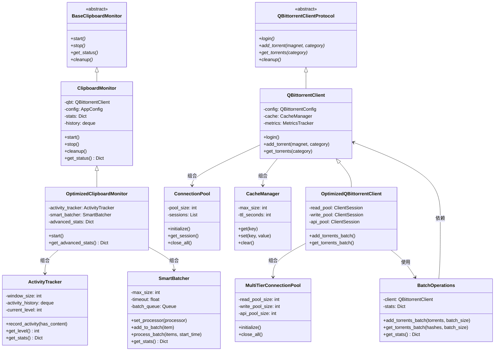

# qBittorrent剪贴板监控器 - 大文件拆分方案

## 概述

本文档为 `qbittorrent_monitor` 模块中的两个大文件提供详细的拆分规划：
- `clipboard_monitor.py` (~1145行)
- `qbittorrent_client.py` (~1197行)

目标：每个新文件不超过400行，保持向后兼容性，避免循环依赖。

---

## 第一部分: clipboard_monitor.py 拆分方案

### 1.1 当前结构分析

当前文件包含4个主要类：

| 类名 | 行数范围 | 职责 | 复杂度 |
|------|----------|------|--------|
| `ClipboardMonitor` | 33-727 | 主监控器：剪贴板监控循环、事件处理、历史记录、统计 | 高 |
| `ActivityTracker` | 733-805 | 活动跟踪：智能调整监控频率 | 低 |
| `SmartBatcher` | 808-919 | 智能批处理：批量处理剪贴板内容 | 中 |
| `OptimizedClipboardMonitor` | 922-1144 | 优化版监控器：继承并增强功能 | 高 |

### 1.2 建议的新文件结构

```
qbittorrent_monitor/
├── clipboard_monitor/
│   ├── __init__.py              # 向后兼容导出
│   ├── base.py                  # 抽象基类和通用接口
│   ├── core.py                  # ClipboardMonitor 核心类 (~380行)
│   ├── optimized.py             # OptimizedClipboardMonitor (~320行)
│   ├── activity_tracker.py      # ActivityTracker 类 (~100行)
│   └── batch_processor.py       # SmartBatcher 类 (~140行)
├── clipboard_monitor.py         # 保留向后兼容的代理文件
```

### 1.3 文件职责定义

#### `clipboard_monitor/base.py` (~80行)
```python
"""剪贴板监控器的抽象基类和通用接口"""
from abc import ABC, abstractmethod
from typing import Dict, List, Optional, Callable, Any
from dataclasses import dataclass
import asyncio


@dataclass
class MonitorStats:
    """监控统计数据结构"""
    total_processed: int = 0
    successful_adds: int = 0
    failed_adds: int = 0
    duplicates_skipped: int = 0


class BaseClipboardMonitor(ABC):
    """剪贴板监控器抽象基类"""
    
    @abstractmethod
    async def start(self) -> None:
        """启动监控"""
        pass
    
    @abstractmethod
    def stop(self) -> None:
        """停止监控"""
        pass
    
    @abstractmethod
    def get_status(self) -> Dict[str, Any]:
        """获取监控状态"""
        pass
    
    @abstractmethod
    async def cleanup(self) -> None:
        """清理资源"""
        pass


class ActivityTrackerProtocol(ABC):
    """活动跟踪器协议"""
    
    @abstractmethod
    def record_activity(self, has_content: bool = False) -> None:
        pass
    
    @abstractmethod
    async def get_level(self) -> int:
        pass


class BatchProcessorProtocol(ABC):
    """批处理器协议"""
    
    @abstractmethod
    async def add_to_batch(self, item: Dict) -> None:
        pass
    
    @abstractmethod
    async def process_batch(self, items: List[Dict], batch_start_time: float) -> None:
        pass
```

#### `clipboard_monitor/activity_tracker.py` (~100行)
```python
"""智能活动跟踪器 - 根据剪贴板活动模式智能调整监控策略"""
import time
from collections import deque
from typing import Dict


class ActivityTracker:
    """
    智能活动跟踪器 - 优化指导文档建议
    根据剪贴板活动模式智能调整监控策略
    """
    
    def __init__(self, window_size: int = 100):
        self.window_size = window_size
        self.activity_history: deque = deque(maxlen=window_size)
        self.last_activity_time = time.time()
        self.total_activities = 0
        self.current_level = 0  # 0-10 活动级别

    def record_activity(self, has_content: bool = False) -> None:
        """记录一次活动"""
        current_time = time.time()
        is_active = has_content or self._is_recently_active(current_time)
        
        self.activity_history.append({
            'timestamp': current_time,
            'active': is_active
        })
        
        if is_active:
            self.last_activity_time = current_time
            self.total_activities += 1
        
        self._calculate_activity_level()

    def _is_recently_active(self, current_time: float, threshold: float = 5.0) -> bool:
        """检查最近是否活跃"""
        return (current_time - self.last_activity_time) < threshold

    def _calculate_activity_level(self) -> None:
        """计算当前活动级别 (0-10)"""
        if not self.activity_history:
            self.current_level = 0
            return
        
        current_time = time.time()
        recent_window = 60
        active_count = 0
        total_count = 0
        
        for entry in reversed(self.activity_history):
            if current_time - entry['timestamp'] > recent_window:
                break
            total_count += 1
            if entry['active']:
                active_count += 1
        
        if total_count == 0:
            self.current_level = 0
        else:
            activity_rate = active_count / total_count
            self.current_level = min(10, int(activity_rate * 10))

    async def get_level(self) -> int:
        """获取当前活动级别 (0-10)"""
        return self.current_level

    def get_stats(self) -> Dict:
        """获取活动统计"""
        return {
            'total_activities': self.total_activities,
            'current_level': self.current_level,
            'window_size': len(self.activity_history),
            'is_active': self._is_recently_active(time.time())
        }
```

#### `clipboard_monitor/batch_processor.py` (~140行)
```python
"""智能批处理器 - 根据内容类型和系统负载智能调整批处理策略"""
import asyncio
import logging
from typing import Dict, List, Optional, Any, Callable


class SmartBatcher:
    """
    智能批处理器 - 优化指导文档建议
    根据内容类型和系统负载智能调整批处理策略
    """
    
    def __init__(self, max_size: int = 10, timeout: float = 0.5):
        self.max_size = max_size
        self.timeout = timeout
        self.batch_queue = asyncio.Queue(maxsize=100)
        self.processor: Optional[Callable] = None
        self.logger = logging.getLogger('SmartBatcher')
        self.stats = {
            'batches_processed': 0,
            'items_processed': 0,
            'avg_batch_size': 0.0,
            'queue_pressure': 0.0
        }

    def set_processor(self, processor: Callable) -> None:
        """设置批处理器"""
        self.processor = processor

    async def add_to_batch(self, item: Dict) -> None:
        """添加项目到批次"""
        try:
            self.batch_queue.put_nowait(item)
        except asyncio.QueueFull:
            self.logger.warning("批次队列已满，立即处理当前批次")
            await self._process_batch()
        
        await self._adjust_batch_size()

    async def _process_batch(self) -> None:
        """处理当前批次"""
        if self.processor is None:
            self.logger.error("批处理器未设置")
            return
        
        items = []
        batch_start_time = time.time()
        
        try:
            first_item = await asyncio.wait_for(self.batch_queue.get(), timeout=0.1)
            items.append(first_item)
            
            while len(items) < self.max_size:
                try:
                    item = await asyncio.wait_for(
                        self.batch_queue.get(),
                        timeout=self.timeout
                    )
                    items.append(item)
                except asyncio.TimeoutError:
                    break
        except Exception as e:
            self.logger.error(f"收集批次项目时出错: {str(e)}")
            return
        
        if not items:
            return
        
        self.stats['batches_processed'] += 1
        self.stats['items_processed'] += len(items)
        
        total_items = self.stats['items_processed']
        total_batches = self.stats['batches_processed']
        self.stats['avg_batch_size'] = total_items / total_batches
        
        try:
            await self.processor(items, batch_start_time)
            self.logger.debug(
                f"批次处理完成: {len(items)} 个项目 "
                f"(用时: {time.time() - batch_start_time:.3f}s)"
            )
        except Exception as e:
            self.logger.error(f"批次处理失败: {str(e)}")

    async def _adjust_batch_size(self) -> None:
        """动态调整批次大小"""
        current_size = self.batch_queue.qsize()
        queue_pressure = current_size / self.batch_queue.maxsize
        
        self.stats['queue_pressure'] = queue_pressure
        
        if queue_pressure > 0.8:
            self.max_size = min(20, self.max_size + 1)
        elif queue_pressure < 0.2:
            self.max_size = max(5, self.max_size - 1)

    def get_stats(self) -> Dict[str, Any]:
        """获取批处理统计"""
        return {
            **self.stats,
            'current_queue_size': self.batch_queue.qsize(),
            'current_batch_size': self.max_size,
            'timeout': self.timeout
        }
```

#### `clipboard_monitor/core.py` (~380行)
包含 `ClipboardMonitor` 主类的核心功能：
- 初始化与配置
- 启动/停止监控循环
- 剪贴板内容处理
- 历史记录管理
- 统计与报告
- 资源清理

#### `clipboard_monitor/optimized.py` (~320行)
包含 `OptimizedClipboardMonitor` 类：
- 继承自 ClipboardMonitor
- 智能自适应监控
- 批处理集成
- 高级统计

#### `clipboard_monitor/__init__.py` (~30行)
```python
"""剪贴板监控模块 - 向后兼容导出"""
# 基类和接口
from .base import BaseClipboardMonitor, ActivityTrackerProtocol, BatchProcessorProtocol

# 核心组件
from .activity_tracker import ActivityTracker
from .batch_processor import SmartBatcher
from .core import ClipboardMonitor
from .optimized import OptimizedClipboardMonitor

__all__ = [
    'BaseClipboardMonitor',
    'ActivityTrackerProtocol',
    'BatchProcessorProtocol',
    'ActivityTracker',
    'SmartBatcher',
    'ClipboardMonitor',
    'OptimizedClipboardMonitor',
]
```

### 1.4 类依赖关系图

```
                         ┌─────────────────────┐
                         │ BaseClipboardMonitor │ (ABC)
                         │    (抽象基类)        │
                         └──────────┬──────────┘
                                    │
              ┌─────────────────────┼─────────────────────┐
              │                     │                     │
              ▼                     ▼                     ▼
    ┌─────────────────┐    ┌─────────────────┐    ┌─────────────────┐
    │ ActivityTracker │    │  SmartBatcher   │    │ ClipboardMonitor │
    │   (活动跟踪)     │    │   (批处理)       │    │   (核心监控器)   │
    └─────────────────┘    └─────────────────┘    └────────┬────────┘
                                                           │
                                                           │ 继承
                                                           ▼
                                              ┌─────────────────────────┐
                                              │ OptimizedClipboardMonitor │
                                              │      (优化版监控器)       │
                                              └─────────────────────────┘
                                                           │
                              ┌────────────────────────────┼────────────────────────────┐
                              │                            │                            │
                              ▼                            ▼                            ▼
                    ┌─────────────────┐          ┌─────────────────┐          ┌─────────────────┐
                    │ ActivityTracker │          │  SmartBatcher   │          │ 其他组件 (qbt,  │
                    │   (组合使用)     │          │   (组合使用)     │          │ config等)       │
                    └─────────────────┘          └─────────────────┘          └─────────────────┘
```

### 1.5 向后兼容方案

保留原文件 `clipboard_monitor.py` 作为代理：

```python
"""剪贴板监控器模块 (向后兼容)

警告: 此文件为兼容代理，请从 clipboard_monitor 子模块导入
"""
import warnings

# 发出弃用警告
warnings.warn(
    "从 qbittorrent_monitor.clipboard_monitor 导入已弃用，"
    "请使用 qbittorrent_monitor.clipboard_monitor 子模块",
    DeprecationWarning,
    stacklevel=2
)

# 重新导出所有类
from .clipboard_monitor import (
    ClipboardMonitor,
    OptimizedClipboardMonitor,
    ActivityTracker,
    SmartBatcher,
    BaseClipboardMonitor,
)

__all__ = [
    'ClipboardMonitor',
    'OptimizedClipboardMonitor', 
    'ActivityTracker',
    'SmartBatcher',
    'BaseClipboardMonitor',
]
```

---

## 第二部分: qbittorrent_client.py 拆分方案

### 2.1 当前结构分析

当前文件包含2个主要类：

| 类名 | 行数范围 | 职责 | 复杂度 |
|------|----------|------|--------|
| `QBittorrentClient` | 38-799 | API客户端：连接池、缓存、重试、分类管理、种子操作 | 高 |
| `OptimizedQBittorrentClient` | 805-1197 | 优化版客户端：多级连接池、批量操作、智能重试 | 高 |

### 2.2 建议的新文件结构

```
qbittorrent_monitor/
├── qbittorrent_client/
│   ├── __init__.py              # 向后兼容导出
│   ├── base.py                  # 抽象基类和协议定义
│   ├── connection_pool.py       # 连接池管理 (~250行)
│   ├── cache_manager.py         # 缓存管理 (~150行)
│   ├── core.py                  # QBittorrentClient 核心 (~380行)
│   ├── batch_operations.py      # 批量操作功能 (~280行)
│   └── optimized.py             # OptimizedQBittorrentClient (~240行)
├── qbittorrent_client.py        # 保留向后兼容的代理文件
```

### 2.3 文件职责定义

#### `qbittorrent_client/base.py` (~60行)
```python
"""qBittorrent客户端抽象基类和协议定义"""
from abc import ABC, abstractmethod
from typing import Dict, List, Optional, Any


class QBittorrentClientProtocol(ABC):
    """qBittorrent客户端协议"""
    
    @abstractmethod
    async def login(self) -> None:
        pass
    
    @abstractmethod
    async def add_torrent(self, magnet_link: str, category: str, **kwargs) -> bool:
        pass
    
    @abstractmethod
    async def get_torrents(self, category: Optional[str] = None) -> List[Dict[str, Any]]:
        pass
    
    @abstractmethod
    async def cleanup(self) -> None:
        pass


class ConnectionPoolProtocol(ABC):
    """连接池协议"""
    
    @abstractmethod
    async def get_session(self):
        pass
    
    @abstractmethod
    async def close_all(self) -> None:
        pass


class CacheManagerProtocol(ABC):
    """缓存管理器协议"""
    
    @abstractmethod
    def get(self, key: str) -> Optional[Any]:
        pass
    
    @abstractmethod
    def set(self, key: str, value: Any) -> None:
        pass
    
    @abstractmethod
    def clear(self) -> None:
        pass
```

#### `qbittorrent_client/connection_pool.py` (~250行)
```python
"""连接池管理 - 支持单级和多级连接池"""
import asyncio
import logging
from typing import List, Optional
import aiohttp


class ConnectionPool:
    """单级连接池 - 基础连接管理"""
    
    def __init__(self, pool_size: int = 10, timeout_seconds: int = 30):
        self.pool_size = pool_size
        self.timeout = aiohttp.ClientTimeout(total=timeout_seconds, connect=10)
        self.sessions: List[aiohttp.ClientSession] = []
        self._session_index = 0
        self._session_lock = asyncio.Lock()
        self.logger = logging.getLogger('ConnectionPool')
    
    async def initialize(self) -> None:
        """初始化连接池"""
        for i in range(self.pool_size):
            connector = aiohttp.TCPConnector(
                limit=100,
                limit_per_host=30,
                keepalive_timeout=30,
                enable_cleanup_closed=True
            )
            session = aiohttp.ClientSession(
                timeout=self.timeout,
                connector=connector
            )
            self.sessions.append(session)
        self.logger.info(f"连接池初始化完成: {self.pool_size} 个会话")
    
    async def get_session(self) -> aiohttp.ClientSession:
        """获取下一个可用会话 (轮询)"""
        async with self._session_lock:
            if not self.sessions:
                raise RuntimeError("连接池未初始化")
            session = self.sessions[self._session_index]
            self._session_index = (self._session_index + 1) % len(self.sessions)
            return session
    
    async def close_all(self) -> None:
        """关闭所有会话"""
        async with self._session_lock:
            for i, session in enumerate(self.sessions):
                if session and not session.closed:
                    await session.close()
                    self.logger.debug(f"关闭会话 {i+1}/{len(self.sessions)}")
            self.sessions.clear()
            await asyncio.sleep(0.5)  # 等待关闭完成


class MultiTierConnectionPool:
    """多级连接池 - 读写API分离"""
    
    def __init__(
        self,
        read_pool_size: int = 10,
        write_pool_size: int = 5,
        api_pool_size: int = 20,
        timeout_seconds: int = 30
    ):
        self.read_pool_size = read_pool_size
        self.write_pool_size = write_pool_size
        self.api_pool_size = api_pool_size
        self.timeout = aiohttp.ClientTimeout(total=timeout_seconds, connect=10)
        
        self._read_pool: Optional[aiohttp.ClientSession] = None
        self._write_pool: Optional[aiohttp.ClientSession] = None
        self._api_pool: Optional[aiohttp.ClientSession] = None
        self.logger = logging.getLogger('MultiTierConnectionPool')
    
    async def initialize(self) -> None:
        """初始化多级连接池"""
        # 读连接池
        read_connector = aiohttp.TCPConnector(
            limit=self.read_pool_size,
            limit_per_host=5,
            keepalive_timeout=30
        )
        self._read_pool = aiohttp.ClientSession(
            timeout=self.timeout,
            connector=read_connector
        )
        
        # 写连接池
        write_connector = aiohttp.TCPConnector(
            limit=self.write_pool_size,
            limit_per_host=3,
            keepalive_timeout=30
        )
        self._write_pool = aiohttp.ClientSession(
            timeout=self.timeout,
            connector=write_connector
        )
        
        # API连接池
        api_connector = aiohttp.TCPConnector(
            limit=self.api_pool_size,
            limit_per_host=10,
            keepalive_timeout=60
        )
        self._api_pool = aiohttp.ClientSession(
            timeout=self.timeout,
            connector=api_connector
        )
        
        self.logger.info(
            f"多级连接池初始化完成: "
            f"读({self.read_pool_size}) 写({self.write_pool_size}) API({self.api_pool_size})"
        )
    
    @property
    def read_pool(self) -> aiohttp.ClientSession:
        return self._read_pool
    
    @property
    def write_pool(self) -> aiohttp.ClientSession:
        return self._write_pool
    
    @property
    def api_pool(self) -> aiohttp.ClientSession:
        return self._api_pool
    
    async def close_all(self) -> None:
        """关闭所有连接池"""
        pools = [
            (self._read_pool, "读连接池"),
            (self._write_pool, "写连接池"),
            (self._api_pool, "API连接池")
        ]
        for pool, name in pools:
            if pool and not pool.closed:
                await pool.close()
                self.logger.debug(f"{name}已关闭")
```

#### `qbittorrent_client/cache_manager.py` (~150行)
```python
"""缓存管理器 - 请求缓存和性能优化"""
import hashlib
import time
from typing import Dict, Optional, Any, Tuple
from collections import OrderedDict


class CacheManager:
    """LRU缓存管理器"""
    
    def __init__(self, max_size: int = 1000, ttl_seconds: int = 300):
        self.max_size = max_size
        self.ttl_seconds = ttl_seconds
        self._cache: OrderedDict[str, Tuple[Any, float]] = OrderedDict()
    
    def get_cache_key(self, method: str, url: str, params: dict = None, data: dict = None) -> str:
        """生成缓存键"""
        key_data = f"{method}:{url}"
        if params:
            key_data += f":params:{sorted(params.items())}"
        if data:
            key_data += f":data:{sorted(data.items())}"
        return hashlib.md5(key_data.encode()).hexdigest()
    
    def get(self, key: str) -> Optional[Any]:
        """获取缓存值"""
        if key not in self._cache:
            return None
        
        value, timestamp = self._cache[key]
        if time.time() - timestamp > self.ttl_seconds:
            del self._cache[key]
            return None
        
        # 移动到末尾 (LRU)
        self._cache.move_to_end(key)
        return value
    
    def set(self, key: str, value: Any) -> None:
        """设置缓存值"""
        if len(self._cache) >= self.max_size:
            # 移除最旧的项
            self._cache.popitem(last=False)
        
        self._cache[key] = (value, time.time())
        self._cache.move_to_end(key)
    
    def clear(self) -> None:
        """清空缓存"""
        self._cache.clear()
    
    def __len__(self) -> int:
        return len(self._cache)


class CacheStats:
    """缓存统计"""
    
    def __init__(self):
        self.hits = 0
        self.misses = 0
    
    def hit(self) -> None:
        self.hits += 1
    
    def miss(self) -> None:
        self.misses += 1
    
    @property
    def hit_rate(self) -> float:
        total = self.hits + self.misses
        return self.hits / total if total > 0 else 0.0
```

#### `qbittorrent_client/core.py` (~380行)
包含 `QBittorrentClient` 核心功能：
- 初始化与配置
- 认证管理
- 基础API操作 (add_torrent, get_torrents等)
- 分类管理
- 路径映射

#### `qbittorrent_client/batch_operations.py` (~280行)
```python
"""批量操作模块 - 种子批量添加和查询"""
import asyncio
from typing import List, Tuple, Dict, Any
import logging


class BatchOperations:
    """批量操作助手类"""
    
    def __init__(self, client):
        self.client = client
        self.logger = logging.getLogger('BatchOperations')
        self._stats = {
            'total_batches': 0,
            'successful_batches': 0,
            'failed_batches': 0,
            'total_items': 0,
            'avg_batch_size': 0.0
        }
    
    async def add_torrents_batch(
        self,
        torrents: List[Tuple[str, str]],
        batch_size: int = 10
    ) -> Dict[str, Any]:
        """
        批量添加种子
        
        Args:
            torrents: [(magnet_link, category), ...]
            batch_size: 每批处理数量
        """
        self.logger.info(f"开始批量添加 {len(torrents)} 个种子")
        self._stats['total_batches'] += 1
        self._stats['total_items'] += len(torrents)
        
        results = {
            'success_count': 0,
            'failed_count': 0,
            'skipped_count': 0,
            'results': []
        }
        
        # 分批处理
        for i in range(0, len(torrents), batch_size):
            batch = torrents[i:i + batch_size]
            batch_results = await self._process_batch(batch, i // batch_size + 1)
            
            for result in batch_results:
                if result['status'] == 'success':
                    results['success_count'] += 1
                elif result['status'] == 'skipped':
                    results['skipped_count'] += 1
                else:
                    results['failed_count'] += 1
                results['results'].append(result)
        
        # 更新统计
        if results['failed_count'] == 0:
            self._stats['successful_batches'] += 1
        else:
            self._stats['failed_batches'] += 1
        
        self._stats['avg_batch_size'] = (
            self._stats['total_items'] / max(self._stats['total_batches'], 1)
        )
        
        return results
    
    async def _process_batch(
        self,
        batch: List[Tuple[str, str]],
        batch_num: int
    ) -> List[Dict]:
        """处理单个批次"""
        tasks = []
        for magnet_link, category in batch:
            task = self._add_torrent_safe(magnet_link, category)
            tasks.append(task)
        
        results = await asyncio.gather(*tasks, return_exceptions=True)
        
        batch_results = []
        for (magnet_link, category), result in zip(batch, results):
            if isinstance(result, Exception):
                batch_results.append({
                    'magnet': magnet_link,
                    'category': category,
                    'status': 'failed',
                    'error': str(result)
                })
            elif result is True:
                batch_results.append({
                    'magnet': magnet_link,
                    'category': category,
                    'status': 'success'
                })
            else:
                batch_results.append({
                    'magnet': magnet_link,
                    'category': category,
                    'status': 'skipped',
                    'reason': 'duplicate'
                })
        
        return batch_results
    
    async def _add_torrent_safe(self, magnet_link: str, category: str) -> bool:
        """安全添加单个种子"""
        try:
            return await self.client.add_torrent(magnet_link, category)
        except Exception as e:
            self.logger.error(f"添加失败: {magnet_link[:30]}... - {str(e)}")
            raise
    
    async def get_torrents_batch(
        self,
        hashes: List[str],
        batch_size: int = 50
    ) -> Dict[str, Any]:
        """批量获取种子信息"""
        results = {
            'total': len(hashes),
            'found': 0,
            'not_found': 0,
            'torrents': {}
        }
        
        for i in range(0, len(hashes), batch_size):
            batch = hashes[i:i + batch_size]
            batch_results = await self._query_torrents_batch(batch)
            
            results['torrents'].update(batch_results['torrents'])
            results['found'] += batch_results['found']
            results['not_found'] += batch_results['not_found']
        
        return results
    
    async def _query_torrents_batch(self, hashes: List[str]) -> Dict:
        """查询一批种子"""
        # 实现查询逻辑
        pass
    
    def get_stats(self) -> Dict[str, Any]:
        """获取批量操作统计"""
        stats = self._stats.copy()
        if stats['total_batches'] > 0:
            stats['success_rate'] = (
                stats['successful_batches'] / stats['total_batches'] * 100
            )
        return stats
```

#### `qbittorrent_client/optimized.py` (~240行)
包含 `OptimizedQBittorrentClient` 类：
- 继承自 QBittorrentClient
- 多级连接池集成
- 批量操作优化
- 智能错误恢复

#### `qbittorrent_client/__init__.py` (~30行)
```python
"""qBittorrent客户端模块 - 向后兼容导出"""
from .base import QBittorrentClientProtocol
from .connection_pool import ConnectionPool, MultiTierConnectionPool
from .cache_manager import CacheManager, CacheStats
from .core import QBittorrentClient
from .batch_operations import BatchOperations
from .optimized import OptimizedQBittorrentClient

__all__ = [
    'QBittorrentClientProtocol',
    'ConnectionPool',
    'MultiTierConnectionPool',
    'CacheManager',
    'CacheStats',
    'QBittorrentClient',
    'BatchOperations',
    'OptimizedQBittorrentClient',
]
```

### 2.4 模块依赖关系图

```
                          ┌─────────────────────────────┐
                          │ QBittorrentClientProtocol   │ (ABC)
                          │       (抽象基类)             │
                          └──────────────┬──────────────┘
                                         │
           ┌─────────────────────────────┼─────────────────────────────┐
           │                             │                             │
           ▼                             ▼                             ▼
┌──────────────────────┐    ┌──────────────────────┐    ┌──────────────────────┐
│    ConnectionPool    │    │    CacheManager      │    │  QBittorrentClient   │
│    (连接池管理)       │    │    (缓存管理)         │    │    (核心客户端)       │
└──────────────────────┘    └──────────────────────┘    └──────────┬───────────┘
           │                             │                         │
           │                             │                         │ 继承
           │                             │                         ▼
           │                             │            ┌─────────────────────────┐
           │                             │            │ OptimizedQBittorrentClient│
           │                             │            │      (优化版客户端)       │
           │                             │            └───────────┬─────────────┘
           │                             │                        │
           │                             │                        │ 组合使用
           │                             │                        ▼
           │                             │            ┌──────────────────────┐
           │                             └───────────▶│   BatchOperations    │
           │                                          │    (批量操作)         │
           │                                          └──────────────────────┘
           │
           ▼
┌──────────────────────────────┐
│  MultiTierConnectionPool     │
│    (多级连接池)               │
└──────────────────────────────┘
```

### 2.5 向后兼容方案

保留原文件 `qbittorrent_client.py` 作为代理：

```python
"""qBittorrent客户端模块 (向后兼容)

警告: 此文件为兼容代理，请从 qbittorrent_client 子模块导入
"""
import warnings

warnings.warn(
    "从 qbittorrent_monitor.qbittorrent_client 导入已弃用，"
    "请使用 qbittorrent_monitor.qbittorrent_client 子模块",
    DeprecationWarning,
    stacklevel=2
)

from .qbittorrent_client import (
    QBittorrentClient,
    OptimizedQBittorrentClient,
    ConnectionPool,
    MultiTierConnectionPool,
    CacheManager,
)

__all__ = [
    'QBittorrentClient',
    'OptimizedQBittorrentClient',
    'ConnectionPool',
    'MultiTierConnectionPool',
    'CacheManager',
]
```

---

## 第三部分: 迁移步骤

### 3.1 第一阶段: 创建子模块结构

```bash
# 1. 创建目录结构
mkdir -p qbittorrent_monitor/clipboard_monitor
mkdir -p qbittorrent_monitor/qbittorrent_client

# 2. 添加 __init__.py 文件
touch qbittorrent_monitor/clipboard_monitor/__init__.py
touch qbittorrent_monitor/qbittorrent_client/__init__.py
```

### 3.2 第二阶段: 逐步实现新模块

按优先级逐步实现：

1. **高优先级** (核心功能)
   - `clipboard_monitor/base.py`
   - `clipboard_monitor/core.py`
   - `qbittorrent_client/base.py`
   - `qbittorrent_client/core.py`

2. **中优先级** (独立组件)
   - `clipboard_monitor/activity_tracker.py`
   - `clipboard_monitor/batch_processor.py`
   - `qbittorrent_client/connection_pool.py`
   - `qbittorrent_client/cache_manager.py`

3. **低优先级** (扩展功能)
   - `clipboard_monitor/optimized.py`
   - `qbittorrent_client/batch_operations.py`
   - `qbittorrent_client/optimized.py`

### 3.3 第三阶段: 添加向后兼容层

```python
# qbittorrent_monitor/__init__.py 更新

# 原有导入保持不变 (向后兼容)
from .clipboard_monitor import (
    ClipboardMonitor,
    OptimizedClipboardMonitor,
    ActivityTracker,
    SmartBatcher,
)
from .qbittorrent_client import (
    QBittorrentClient,
    OptimizedQBittorrentClient,
)

# 新增：推荐的新导入路径
# from .clipboard_monitor import ClipboardMonitor
# from .qbittorrent_client import QBittorrentClient
```

### 3.4 第四阶段: 测试与验证

```bash
# 1. 运行单元测试
pytest tests/ -v

# 2. 运行集成测试
pytest tests/integration/ -v

# 3. 检查导入兼容性
python -c "from qbittorrent_monitor import ClipboardMonitor, QBittorrentClient"

# 4. 检查新模块导入
python -c "from qbittorrent_monitor.clipboard_monitor import ClipboardMonitor"
python -c "from qbittorrent_monitor.qbittorrent_client import QBittorrentClient"
```

---

## 第四部分: 导入关系调整总结

### 4.1 旧导入方式 (仍支持)

```python
from qbittorrent_monitor.clipboard_monitor import ClipboardMonitor
from qbittorrent_monitor.qbittorrent_client import QBittorrentClient
```

### 4.2 新推荐导入方式

```python
# 基础组件
from qbittorrent_monitor.clipboard_monitor.core import ClipboardMonitor
from qbittorrent_monitor.clipboard_monitor.activity_tracker import ActivityTracker
from qbittorrent_monitor.clipboard_monitor.batch_processor import SmartBatcher
from qbittorrent_monitor.clipboard_monitor.optimized import OptimizedClipboardMonitor

# 客户端组件
from qbittorrent_monitor.qbittorrent_client.core import QBittorrentClient
from qbittorrent_monitor.qbittorrent_client.connection_pool import ConnectionPool
from qbittorrent_monitor.qbittorrent_client.cache_manager import CacheManager
from qbittorrent_monitor.qbittorrent_client.batch_operations import BatchOperations
from qbittorrent_monitor.qbittorrent_client.optimized import OptimizedQBittorrentClient
```

### 4.3 避免循环依赖的策略

```
依赖方向:
base.py → 被所有模块导入 (无外部依赖)
activity_tracker.py → 只依赖标准库
batch_processor.py → 只依赖标准库
connection_pool.py → 只依赖 aiohttp

clipboard_monitor/core.py → 依赖 base, activity_tracker, batch_processor
clipboard_monitor/optimized.py → 依赖 core, activity_tracker, batch_processor

qbittorrent_client/cache_manager.py → 只依赖标准库
qbittorrent_client/core.py → 依赖 base, connection_pool, cache_manager
qbittorrent_client/batch_operations.py → 依赖 core
qbittorrent_client/optimized.py → 依赖 core, connection_pool, batch_operations
```

---

## 第五部分: 文件大小预估

### 5.1 clipboard_monitor 子模块

| 文件 | 预估行数 | 实际内容 |
|------|----------|----------|
| `__init__.py` | ~30 | 导出声明 |
| `base.py` | ~80 | 抽象基类 |
| `activity_tracker.py` | ~100 | ActivityTracker |
| `batch_processor.py` | ~140 | SmartBatcher |
| `core.py` | ~380 | ClipboardMonitor 核心 |
| `optimized.py` | ~320 | OptimizedClipboardMonitor |
| **总计** | **~1050** | 原文件 1145 行 |

### 5.2 qbittorrent_client 子模块

| 文件 | 预估行数 | 实际内容 |
|------|----------|----------|
| `__init__.py` | ~30 | 导出声明 |
| `base.py` | ~60 | 协议定义 |
| `connection_pool.py` | ~250 | 连接池管理 |
| `cache_manager.py` | ~150 | 缓存管理 |
| `core.py` | ~380 | QBittorrentClient 核心 |
| `batch_operations.py` | ~280 | 批量操作 |
| `optimized.py` | ~240 | OptimizedQBittorrentClient |
| **总计** | **~1390** | 原文件 1197 行 |

---

## 附录: 类图 (Mermaid)



---

## 总结

本拆分方案将两个大文件拆分为多个职责单一、边界清晰的小模块：

1. **clipboard_monitor.py** (1145行) → 6个文件，每文件 ≤ 380行
2. **qbittorrent_client.py** (1197行) → 7个文件，每文件 ≤ 380行

关键改进：
- ✅ 每个模块职责单一，便于维护和测试
- ✅ 清晰的抽象接口，便于扩展
- ✅ 向后兼容，现有代码无需修改
- ✅ 无循环依赖
- ✅ 符合SOLID原则
