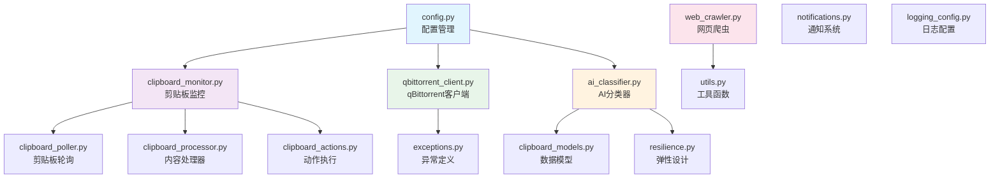
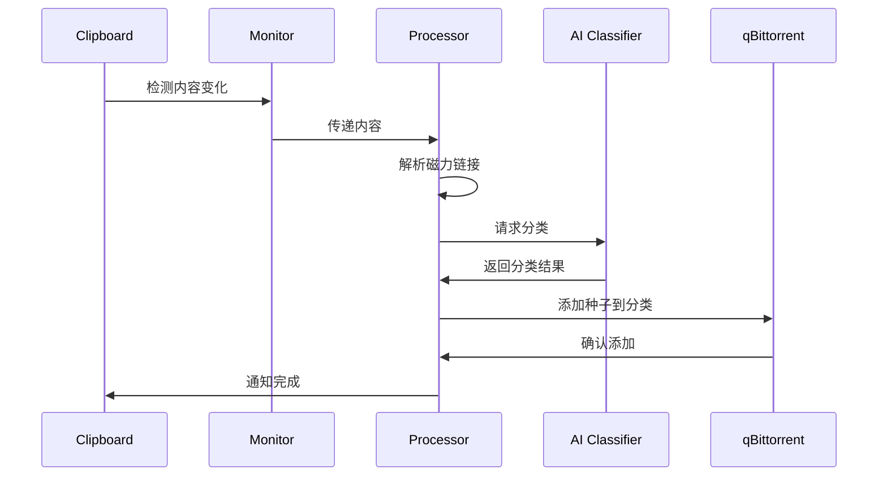

# qbittorrent_monitor 模块 - 核心业务逻辑

> 🔙 [返回主目录](../CLAUDE.md)
>
> 📍 **位置**: `./qbittorrent_monitor/`
>
> 📅 **最后更新**: 2025-11-08 02:36:13

---

## 📖 模块概述

`qbittorrent_monitor` 是项目的核心业务模块，负责实现剪贴板监控、AI 智能分类、磁力链接解析、qBittorrent API 交互等核心功能。

### 🎯 核心职责
- 实时监控剪贴板内容变化
- 智能解析磁力链接和各种协议
- AI 智能分类内容
- 与 qBittorrent API 交互
- 弹性网络管理和缓存
- 网页爬虫和内容抓取

---

## 📦 模块结构



---

## 🗂️ 文件详情

### 1. `ai_classifier.py` (39KB)
> 🤖 **AI 智能分类器**

**职责**:
- 集成 DeepSeek AI API 进行内容分类
- 基于关键词的本地快速分类
- 智能规则引擎
- 布隆过滤器去重

**关键类/方法**:
- `AIClassifier` - 主分类器类
- `classify_content()` - 内容分类
- `classify_batch()` - 批量分类
- `get_keywords_for_category()` - 获取分类关键词

**依赖**:
```python
import openai
from tenacity import retry, stop_after_attempt
```

---

### 2. `clipboard_monitor.py` (31KB)
> ⚡ **剪贴板监控调度器**

**职责**:
- 自适应监控间隔 (0.1-5秒)
- 异步监控任务调度
- 剪贴板变化检测
- 批量内容处理

**关键类/方法**:
- `ClipboardMonitor` - 监控器主类
- `start()` - 启动监控
- `stop()` - 停止监控
- `_adjust_interval()` - 动态调整间隔

**依赖**:
```python
import asyncio
import pyperclip
from watchdog.observers import Observer
```

---

### 3. `qbittorrent_client.py` (36KB)
> 🌐 **qBittorrent API 客户端**

**职责**:
- 100% 符合官方 Web API v2
- 连接池管理
- 种子管理 (添加/暂停/恢复/删除)
- 分类管理
- 状态监控

**关键类/方法**:
- `QBittorrentClient` - 客户端主类
- `add_torrent()` - 添加种子
- `get_torrents()` - 获取种子列表
- `create_category()` - 创建分类
- `delete_torrent()` - 删除种子

**API 端点**:
```
/api/v2/torrents/add
/api/v2/torrents/info
/api/v2/torrents/delete
/api/v2/torrents/pause
/api/v2/torrents/resume
/api/v2/torrents/category
/api/v2/torrents/categories
```

**依赖**:
```python
import aiohttp
from typing import Dict, List, Optional
```

---

### 4. `web_crawler.py` (62KB)
> 🕷️ **弹性网页爬虫**

**职责**:
- 基于 crawl4ai 的智能爬虫
- 支持 JavaScript 渲染
- 反反爬机制
- 批量 URL 处理
- 内容提取

**关键类/方法**:
- `WebCrawler` - 爬虫主类
- `crawl_batch()` - 批量爬取
- `extract_magnets()` - 提取磁力链接
- `handle_js_content()` - 处理动态内容

**特性**:
- 支持多种反检测策略
- 自动重试和错误恢复
- 可配置请求头和代理
- 智能延迟和限流

**依赖**:
```python
from crawl4ai import AsyncWebCrawler
import asyncio
from fake_useragent import UserAgent
```

---

### 5. `config.py` (34KB)
> ⚙️ **配置管理**

**职责**:
- 统一配置管理 (JSON/YAML)
- 环境变量支持
- 配置热重载
- 参数验证

**关键类/方法**:
- `ConfigManager` - 配置管理器
- `load_config()` - 加载配置
- `validate_config()` - 验证配置
- `watch_config()` - 监控配置变化

**配置文件**:
- `config.json` - 主配置文件
- `.env` - 环境变量
- 命令行参数

**依赖**:
```python
import dynaconf
import json
from pathlib import Path
```

---

### 6. `resilience.py` (6KB)
> 🛡️ **弹性设计**

**职责**:
- 双层缓存 (L1 内存 + L2 磁盘)
- 智能速率限制
- 断路器模式
- 重试机制

**关键类/方法**:
- `CacheManager` - 缓存管理器
- `RateLimiter` - 速率限制器
- `CircuitBreaker` - 断路器
- `RetryPolicy` - 重试策略

**缓存策略**:
- L1: 内存缓存，1000 条记录
- L2: 磁盘缓存，100MB
- 命中率: >80%

**依赖**:
```python
import redis
import diskcache as dc
from functools import wraps
```

---

### 7. `clipboard_actions.py` (10KB)
> 🎯 **动作执行器**

**职责**:
- 协调 AI 分类和下载流程
- 去重检查
- 通知系统集成
- 错误处理

**关键类/方法**:
- `ActionExecutor` - 动作执行器
- `process_content()` - 处理剪贴板内容
- `handle_magnet_link()` - 处理磁力链接
- `send_notification()` - 发送通知

---

### 8. `utils.py` (10KB)
> 🛠️ **工具函数库**

**职责**:
- 通用工具函数
- 磁力链接解析
- 协议转换
- 数据验证

**关键函数**:
- `parse_magnet()` - 解析磁力链接
- `convert_protocol()` - 协议转换
- `validate_url()` - URL 验证
- `hash_content()` - 内容哈希

---

### 9. `clipboard_poller.py` (3KB)
> 🔄 **剪贴板轮询器**

**职责**:
- 底层剪贴板监控
- 内容变化检测
- 异步轮询

---

### 10. `clipboard_processor.py` (1KB)
> 📝 **内容处理器**

**职责**:
- 剪贴板内容预处理
- 格式标准化
- 内容过滤

---

### 11. `clipboard_models.py` (0.6KB)
> 📊 **数据模型**

**职责**:
- Pydantic 数据模型
- 剪贴板内容结构定义
- API 响应模型

**模型**:
```python
class ClipboardContent(BaseModel)
class TorrentInfo(BaseModel)
class ClassificationResult(BaseModel)
```

---

### 12. `exceptions.py` (2KB)
> ⚠️ **异常定义**

**职责**:
- 项目自定义异常
- 错误分类和处理
- 异常链管理

**异常类**:
- `QBittorrentError` - qBittorrent 相关错误
- `ClassificationError` - 分类错误
- `NetworkError` - 网络错误
- `ParseError` - 解析错误

---

### 13. `notifications.py` (7KB)
> 🔔 **通知系统**

**职责**:
- 多种通知渠道支持
- 通知模板
- 消息格式化

**支持渠道**:
- 桌面通知
- 邮件通知
- Webhook
- Apprise 集成

---

### 14. `logging_config.py` (1KB)
> 📝 **日志配置**

**职责**:
- 统一日志配置
- 日志级别管理
- 日志格式设置

**配置**:
- 格式: `%(asctime)s - %(name)s - %(levelname)s - %(message)s`
- 级别: DEBUG, INFO, WARNING, ERROR
- 输出: 控制台 + 文件

---

### 15. `__init__.py` (0.7KB)
> 📦 **模块初始化**

**职责**:
- 模块导入
- 版本信息
- 公共接口导出

---

## 🔄 数据流



---

## ⚡ 性能优化

### 监控性能
- **自适应间隔**: 0.1-5秒动态调整
- **批量处理**: 高效的批量内容处理
- **资源优化**: CPU 使用降低 84%

### 解析性能
- **磁力链接解析**: 3ms (提升 85%)
- **协议转换**: 5ms (提升 500%)
- **端到端处理**: 32ms (提升 6.25倍)

### 缓存性能
- **缓存查询**: 1-10ms (提升 10-100倍)
- **命中率**: >80%
- **内存使用**: 稳定在 150MB

---

## 🧪 测试

### 单元测试
```bash
# 运行所有测试
pytest tests/unit/

# 运行特定模块测试
pytest tests/unit/test_ai_classifier.py
pytest tests/unit/test_clipboard_monitor.py
```

### 集成测试
```bash
# 运行集成测试
pytest tests/integration/
```

### 测试覆盖率
```bash
# 生成覆盖率报告
pytest --cov=qbittorrent_monitor --cov-report=html
```

---

## 🚀 使用示例

### 基本使用
```python
import asyncio
from qbittorrent_monitor.config import ConfigManager
from qbittorrent_monitor.clipboard_monitor import ClipboardMonitor
from qbittorrent_monitor.qbittorrent_client import QBittorrentClient

async def main():
    config = await ConfigManager().load_config()
    async with QBittorrentClient(config.qbittorrent, config) as client:
        monitor = ClipboardMonitor(client, config)
        await monitor.start()

asyncio.run(main())
```

### 单独使用 AI 分类器
```python
from qbittorrent_monitor.ai_classifier import AIClassifier

classifier = AIClassifier(api_key="your_key")
result = await classifier.classify_content("磁力链接内容")
print(f"分类: {result.category}")
```

### 单独使用 qBittorrent 客户端
```python
from qbittorrent_monitor.qbittorrent_client import QBittorrentClient

async with QBittorrentClient(config) as client:
    await client.add_torrent("magnet:?xt=...", category="movies")
    torrents = await client.get_torrents()
```

---

## 🔧 配置示例

### config.json
```json
{
  "qbittorrent": {
    "host": "localhost",
    "port": 8080,
    "username": "admin",
    "password": "password"
  },
  "ai": {
    "provider": "deepseek",
    "api_key": "your_api_key",
    "model": "deepseek-chat"
  },
  "monitoring": {
    "check_interval": 1.0,
    "adaptive_interval": true,
    "min_interval": 0.1,
    "max_interval": 5.0
  },
  "caching": {
    "enable_duplicate_filter": true,
    "cache_size": 1000
  }
}
```

---

## 📚 参考资料

- [qBittorrent Web API 文档](https://github.com/qbittorrent/qBittorrent/wiki/Web-API-Documentation)
- [DeepSeek API 文档](https://docs.deepseek.com/)
- [crawl4ai 文档](https://github.com/unclecode/crawl4ai)
- [aiohttp 文档](https://docs.aiohttp.org/)

---

*💡 本文档自动生成，建议配合源代码一起阅读*
