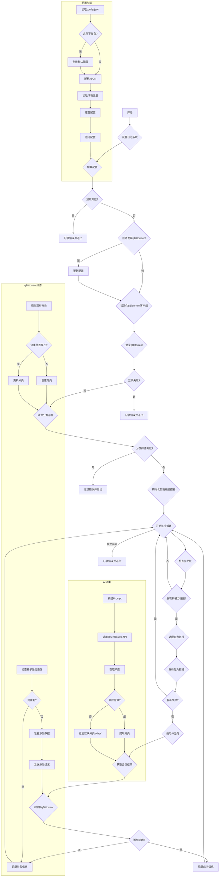

```mermaid
graph TD
    A[开始] --> B{设置日志系统};
    B --> C{加载配置};
    C --> D{加载失败?};
    D -- 是 --> E[记录错误并退出];
    D -- 否 --> F{自动发现qBittorrent?};
    F -- 是 --> G[更新配置];
    F -- 否 --> H{初始化qBittorrent客户端};
    G --> H;
    H --> I{登录qBittorrent};
    I --> J{登录失败?};
    J -- 是 --> K[记录错误并退出];
    J -- 否 --> L{确保分类存在};
    L --> M{分类操作失败?};
    M -- 是 --> N[记录错误并退出];
    M -- 否 --> O{初始化剪贴板监控器};
    O --> P{开始监控循环};
    P --> Q{检查剪贴板};
    Q --> R{发现新磁力链接?};
    R -- 是 --> S{处理磁力链接};
    R -- 否 --> P;
    S --> T{解析磁力链接};
    T --> U{解析失败?};
    U -- 是 --> P;
    U -- 否 --> V{使用AI分类};
    V --> W{获取分类结果};
    W --> X{添加到qBittorrent};
    X --> Y{添加成功?};
    Y -- 是 --> Z[记录成功信息];
    Y -- 否 --> AA[记录失败信息];
    Z --> P;
    AA --> P;
    P -- 发生异常 --> BB[记录错误并退出];

    subgraph 配置加载
        C1[读取config.json] --> C2{文件不存在?};
        C2 -- 是 --> C3[创建默认配置];
        C2 -- 否 --> C4[解析JSON];
        C3 --> C4;
        C4 --> C5[读取环境变量];
        C5 --> C6[覆盖配置];
        C6 --> C7[验证配置];
        C7 --> C;
    end

    subgraph qBittorrent操作
        L1[获取现有分类] --> L2{分类是否存在?};
        L2 -- 否 --> L3[创建分类];
        L2 -- 是 --> L4[更新分类];
        L3 --> L;
        L4 --> L;
        X1[检查种子是否重复] --> X2{是重复?};
        X2 -- 是 --> AA;
        X2 -- 否 --> X3[准备添加数据];
        X3 --> X4[发送添加请求];
        X4 --> X;
    end

    subgraph AI分类
        V1[构建Prompt] --> V2[调用OpenRouter API];
        V2 --> V3[获取响应];
        V3 --> V4{响应有效?};
        V4 -- 是 --> V5[提取分类];
        V4 -- 否 --> V6[返回默认分类'other'];
        V5 --> W;
        V6 --> W;
    end
``` 