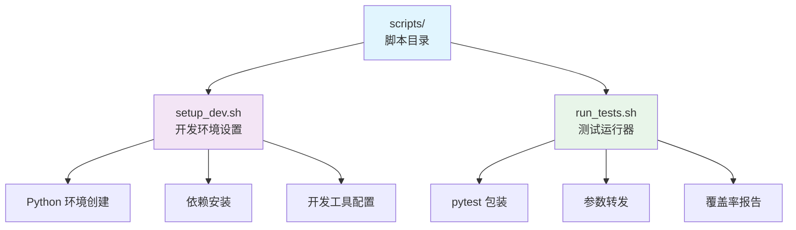

# scripts 目录 - 开发辅助脚本

> 🔙 [返回主目录](../CLAUDE.md)
>
> 📍 **位置**: `./scripts/`
>
> 📅 **最后更新**: 2025-11-08 02:36:13

---

## 📖 目录概述

`scripts` 目录包含项目开发、测试、部署等辅助脚本，简化开发流程。

### 🎯 核心职责
- 开发环境搭建
- 测试运行
- 代码质量检查
- 构建和部署

---

## 📦 脚本列表



---

## 🗂️ 脚本详情

### 1. `setup_dev.sh` (211 bytes)
> 🚀 **开发环境一键设置脚本**

**功能**:
- 创建 Python 虚拟环境
- 安装项目依赖
- 安装开发依赖
- 配置 pre-commit 钩子
- 创建必要目录

**使用方法**:
```bash
# 克隆项目后运行
cd qbittorrent-clipboard-monitor
./scripts/setup_dev.sh

# 或手动执行
bash scripts/setup_dev.sh
```

**执行流程**:
```bash
#!/bin/bash
set -e

echo "🚀 设置开发环境..."

# 1. 创建虚拟环境
python3 -m venv venv
source venv/bin/activate

# 2. 升级 pip
pip install --upgrade pip

# 3. 安装项目依赖
pip install -r requirements.txt

# 4. 安装开发依赖
pip install -r requirements-dev.txt

# 5. 安装项目 (可编辑模式)
pip install -e .

# 6. 安装 pre-commit (可选)
if command -v pre-commit &> /dev/null; then
    pre-commit install
fi

# 7. 创建必要目录
mkdir -p logs
mkdir -p data/cache
mkdir -p config

echo "✅ 开发环境设置完成!"
echo "💡 激活虚拟环境: source venv/bin/activate"
```

**环境要求**:
- Python 3.9+
- pip
- git (可选，用于 pre-commit)

**输出信息**:
```bash
🚀 设置开发环境...
✅ 虚拟环境创建完成
✅ 依赖安装完成
✅ 项目安装完成
✅ 开发环境设置完成!
💡 激活虚拟环境: source venv/bin/activate
```

---

### 2. `run_tests.sh` (146 bytes)
> 🧪 **测试运行包装脚本**

**功能**:
- 包装 pytest 命令
- 转发所有参数
- 设置默认选项
- 生成覆盖率报告

**使用方法**:
```bash
# 运行所有测试
./scripts/run_tests.sh

# 运行特定测试
./scripts/run_tests.sh tests/unit/test_ai_classifier.py

# 传递 pytest 参数
./scripts/run_tests.sh -v --cov=qbittorrent_monitor

# 运行特定标记
./scripts/run_tests.sh -m "unit"
```

**脚本内容**:
```bash
#!/bin/bash
set -e

# 运行测试，传递所有参数给 pytest
python -m pytest "$@"
```

**等效命令**:
```bash
# 以下命令是等效的:
./scripts/run_tests.sh -v
python -m pytest -v

./scripts/run_tests.sh tests/unit/
python -m pytest tests/unit/

./scripts/run_tests.sh --cov=qbittorrent_monitor --cov-report=html
python -m pytest --cov=qbittorrent_monitor --cov-report=html
```

**默认配置**:
如果需要自定义默认选项，可以修改脚本:

```bash
#!/bin/bash
set -e

# 默认选项
DEFAULT_ARGS=(
    --verbose
    --tb=short
    --strict-markers
    --cov=qbittorrent_monitor
    --cov-report=term-missing
    --cov-report=html
)

# 合并默认选项和用户参数
ARGS=("${DEFAULT_ARGS[@]}" "$@")

# 运行 pytest
python -m pytest "${ARGS[@]}"
```

---

## 🔧 常用开发流程

### 1. 新开发者环境搭建
```bash
# 1. 克隆项目
git clone https://github.com/ashllll/qbittorrent-clipboard-monitor.git
cd qbittorrent-clipboard-monitor

# 2. 运行开发环境设置脚本
./scripts/setup_dev.sh

# 3. 激活虚拟环境
source venv/bin/activate

# 4. 验证环境
python -c "import qbittorrent_monitor; print('导入成功')"

# 5. 运行测试
./scripts/run_tests.sh
```

### 2. 日常开发
```bash
# 激活虚拟环境
source venv/bin/activate

# 修改代码...

# 运行测试
./scripts/run_tests.sh -v

# 运行特定测试
./scripts/run_tests.sh tests/unit/test_ai_classifier.py

# 生成覆盖率报告
./scripts/run_tests.sh --cov=qbittorrent_monitor --cov-report=html
```

### 3. 代码质量检查
```bash
# 格式化代码 (需要手动安装 black)
black qbittorrent_monitor/

# 代码检查 (需要手动安装 flake8)
flake8 qbittorrent_monitor/

# 类型检查 (需要手动安装 mypy)
mypy qbittorrent_monitor/
```

---

## 📝 自定义脚本

### 创建新的开发脚本
如果需要添加新的开发脚本，建议遵循以下规范:

**命名规范**:
- 使用小写字母
- 使用下划线分隔
- 添加 `.sh` 后缀
- 具有可执行权限

**脚本模板**:
```bash
#!/bin/bash
#
# 脚本描述: 简短描述脚本功能
#
# 使用方法:
#   ./scripts/your_script.sh [参数]
#

set -e  # 遇到错误立即退出

echo "🚀 开始执行任务..."

# 脚本逻辑
# ...

echo "✅ 任务完成!"
```

**示例: 代码格式化脚本**
```bash
#!/bin/bash
#
# 格式化代码
#

set -e

echo "🎨 格式化代码..."

# 格式化 Python 代码
black qbittorrent_monitor/ tests/

# 排序导入
isort qbittorrent_monitor/ tests/

# 检查代码质量
flake8 qbittorrent_monitor/ tests/

echo "✅ 代码格式化完成!"
```

---

## 🔍 脚本调试

### 启用调试模式
```bash
# 在脚本开头添加
set -x  # 打印每个命令

# 或者运行时指定
bash -x ./scripts/setup_dev.sh
```

### 详细输出
```bash
# 启用详细模式
bash -x ./scripts/run_tests.sh -v
```

### 脚本测试
```bash
# 测试脚本语法
bash -n ./scripts/setup_dev.sh

# 在 dry-run 模式下测试
set -n  # 不执行命令，只检查语法
```

---

## 💡 技巧和最佳实践

### 1. 跨平台兼容性
```bash
# 使用通用 shebang
#!/usr/bin/env bash

# 检查命令是否存在
if ! command -v python3 &> /dev/null; then
    echo "错误: python3 未安装"
    exit 1
fi
```

### 2. 错误处理
```bash
# 遇到错误立即退出
set -e

# 自定义错误处理
set -euo pipefail

# 捕获错误并清理
cleanup() {
    echo "清理临时文件..."
    rm -rf /tmp/temp_dir
}
trap cleanup EXIT
```

### 3. 彩色输出
```bash
# 定义颜色
RED='\033[0;31m'
GREEN='\033[0;32m'
YELLOW='\033[1;33m'
NC='\033[0m' # No Color

echo -e "${GREEN}✅ 成功${NC}"
echo -e "${RED}❌ 错误${NC}"
echo -e "${YELLOW}⚠️  警告${NC}"
```

### 4. 进度指示
```bash
# 使用 spinner
spinner() {
    local pid=$1
    local delay=0.75
    local spinstr='|/-\'
    while [ "$(ps a | awk '{print $1}' | grep $pid)" ]; do
        local temp=${spinstr#?}
        printf " [%c]  " "$spinstr"
        local spinstr=$temp${spinstr%"$temp"}
        sleep $delay
        printf "\b\b\b\b\b\b"
    done
    printf "    \b\b\b\b"
}

# 使用示例
(sleep 5) &
spinner $!
echo "完成"
```

---

## 📚 相关资源

- [Bash 脚本指南](https://www.gnu.org/software/bash/manual/)
- [ShellCheck - 脚本检查工具](https://www.shellcheck.net/)
- [Python 虚拟环境](https://docs.python.org/3/tutorial/venv.html)
- [pytest 文档](https://docs.pytest.org/)

---

## ❓ 常见问题

### Q: 脚本执行权限不足
```bash
# 解决方案: 添加执行权限
chmod +x scripts/*.sh
```

### Q: pip 安装失败
```bash
# 解决方案: 升级 pip
python -m pip install --upgrade pip
```

### Q: 虚拟环境激活失败
```bash
# 解决方案: 使用绝对路径
source $(pwd)/venv/bin/activate
```

### Q: 测试失败但不确定原因
```bash
# 解决方案: 使用详细模式
./scripts/run_tests.sh -v -s --tb=long
```

---

*💡 建议在添加新脚本后，更新此文档并添加使用示例*
