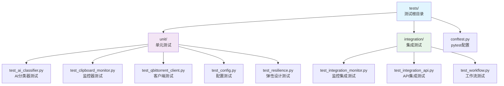

# tests 模块 - 测试套件

> 🔙 [返回主目录](../CLAUDE.md)
>
> 📍 **位置**: `./tests/`
>
> 📅 **最后更新**: 2025-11-08 02:36:13

---

## 📖 模块概述

`tests` 模块包含项目的完整测试套件，确保代码质量和功能正确性。

### 🎯 核心职责
- 单元测试 (Unit Tests)
- 集成测试 (Integration Tests)
- API 测试
- 性能测试
- 覆盖率报告

---

## 📦 模块结构



---

## 🗂️ 文件详情

### 1. `conftest.py` (7KB)
> ⚙️ **pytest 配置和夹具**

**职责**:
- pytest 全局配置
- 共享测试夹具 (fixtures)
- 测试环境准备
- Mock 对象管理

**关键夹具**:
```python
@pytest.fixture
async def qbittorrent_client():
    """qBittorrent 客户端测试夹具"""
    config = load_test_config()
    async with QBittorrentClient(config) as client:
        yield client

@pytest.fixture
def mock_ai_classifier():
    """AI 分类器 Mock 夹具"""
    with patch('qbittorrent_monitor.ai_classifier.AIClassifier') as mock:
        yield mock.return_value

@pytest.fixture
async def clipboard_monitor(qbittorrent_client):
    """剪贴板监控器测试夹具"""
    config = load_test_config()
    monitor = ClipboardMonitor(qbittorrent_client, config)
    await monitor.initialize()
    return monitor
```

**测试配置**:
- 测试数据库配置
- 临时文件管理
- 环境变量设置
- 日志级别调整

---

### 2. `unit/` - 单元测试目录

#### `test_ai_classifier.py`
> 🤖 **AI 分类器单元测试**

**测试范围**:
- AI 分类功能
- 关键词匹配
- 批量分类
- 错误处理
- 缓存机制

**测试用例**:
```python
class TestAIClassifier:
    @pytest.mark.asyncio
    async def test_classify_content(self, mock_ai_classifier):
        """测试单个内容分类"""
        mock_ai_classifier.classify_content.return_value = {
            'category': 'movie',
            'confidence': 0.95
        }
        result = await mock_ai_classifier.classify_content("测试内容")
        assert result['category'] == 'movie'

    @pytest.mark.asyncio
    async def test_classify_batch(self, mock_ai_classifier):
        """测试批量分类"""
        contents = ["内容1", "内容2", "内容3"]
        results = await mock_ai_classifier.classify_batch(contents)
        assert len(results) == 3

    def test_keyword_matching(self):
        """测试关键词匹配"""
        classifier = AIClassifier()
        result = classifier._match_keywords("电影测试")
        assert 'movie' in result
```

---

#### `test_clipboard_monitor.py`
> ⚡ **剪贴板监控器单元测试**

**测试范围**:
- 监控启动/停止
- 内容变化检测
- 自适应间隔
- 批量处理

**测试用例**:
```python
class TestClipboardMonitor:
    @pytest.mark.asyncio
    async def test_start_monitor(self, clipboard_monitor):
        """测试监控启动"""
        await clipboard_monitor.start()
        assert clipboard_monitor.is_running

    @pytest.mark.asyncio
    async def test_stop_monitor(self, clipboard_monitor):
        """测试监控停止"""
        await clipboard_monitor.start()
        await clipboard_monitor.stop()
        assert not clipboard_monitor.is_running

    def test_adjust_interval(self, clipboard_monitor):
        """测试间隔调整"""
        initial = clipboard_monitor.interval
        clipboard_monitor._simulate_high_activity()
        assert clipboard_monitor.interval < initial
```

---

#### `test_qbittorrent_client.py`
> 🌐 **qBittorrent 客户端单元测试**

**测试范围**:
- API 连接
- 种子管理
- 分类操作
- 错误处理

**测试用例**:
```python
class TestQBittorrentClient:
    @pytest.mark.asyncio
    async def test_add_torrent(self, qbittorrent_client):
        """测试添加种子"""
        with aioresponses() as m:
            m.add('POST', '/api/v2/torrents/add', payload={'success': True})
            result = await qbittorrent_client.add_torrent(
                'magnet:?xt=urn:btih:...',
                category='movies'
            )
            assert result['success']

    @pytest.mark.asyncio
    async def test_get_torrents(self, qbittorrent_client):
        """测试获取种子列表"""
        with aioresponses() as m:
            m.add('GET', '/api/v2/torrents/info', payload=[...])
            torrents = await qbittorrent_client.get_torrents()
            assert isinstance(torrents, list)
```

---

#### `test_config.py`
> ⚙️ **配置管理单元测试**

**测试范围**:
- 配置加载
- 配置验证
- 环境变量
- 热重载

**测试用例**:
```python
class TestConfigManager:
    def test_load_config(self):
        """测试配置加载"""
        config = load_test_config()
        assert config.qbittorrent.host == 'localhost'
        assert config.qbittorrent.port == 8080

    def test_validate_config(self):
        """测试配置验证"""
        valid_config = load_valid_config()
        assert validate_config(valid_config)

    def test_invalid_config(self):
        """测试无效配置"""
        invalid_config = load_invalid_config()
        with pytest.raises(ValidationError):
            validate_config(invalid_config)
```

---

#### `test_resilience.py`
> 🛡️ **弹性设计单元测试**

**测试范围**:
- 缓存机制
- 速率限制
- 断路器
- 重试策略

**测试用例**:
```python
class TestResilience:
    def test_cache_get_set(self):
        """测试缓存读写"""
        cache = CacheManager()
        cache.set('key1', 'value1')
        assert cache.get('key1') == 'value1'

    def test_rate_limiter(self):
        """测试速率限制"""
        limiter = RateLimiter(max_requests=10, window=60)
        for i in range(10):
            assert limiter.allow_request()
        assert not limiter.allow_request()

    def test_circuit_breaker(self):
        """测试断路器"""
        breaker = CircuitBreaker(threshold=5)
        # 模拟多次失败
        for _ in range(5):
            breaker.record_failure()
        assert breaker.state == CircuitBreaker.OPEN
```

---

### 3. `integration/` - 集成测试目录

#### `test_integration_monitor.py`
> 🔗 **监控集成测试**

**测试范围**:
- 端到端监控流程
- 剪贴板到下载完整链路
- 错误恢复
- 并发处理

**测试用例**:
```python
class TestMonitorIntegration:
    @pytest.mark.asyncio
    async def test_full_workflow(self, qbittorrent_client, clipboard_monitor):
        """测试完整工作流"""
        # 模拟剪贴板内容
        await clipboard_monitor.simulate_clipboard_change(
            "magnet:?xt=urn:btih:TESTHASH"
        )

        # 等待处理完成
        await asyncio.sleep(2)

        # 验证种子已添加
        torrents = await qbittorrent_client.get_torrents()
        assert len(torrents) > 0

    @pytest.mark.asyncio
    async def test_duplicate_detection(self, clipboard_monitor):
        """测试重复检测"""
        content = "magnet:?xt=urn:btih:TESTHASH"
        await clipboard_monitor.process_content(content)
        await clipboard_monitor.process_content(content)  # 重复内容
        # 验证只处理一次
        assert clipboard_monitor.processed_count == 1
```

---

#### `test_integration_api.py`
> 🌐 **API 集成测试**

**测试范围**:
- RESTful API
- WebSocket 通信
- 认证授权
- 错误响应

**测试用例**:
```python
class TestAPIIntegration:
    @pytest.mark.asyncio
    async def test_rest_api(self, client):
        """测试 REST API"""
        response = await client.get('/api/status')
        assert response.status_code == 200
        data = await response.json()
        assert 'status' in data

    @pytest.mark.asyncio
    async def test_websocket(self, websocket_client):
        """测试 WebSocket 连接"""
        await websocket_client.connect('/ws/status')
        data = await websocket_client.receive_json()
        assert 'timestamp' in data
```

---

#### `test_workflow.py`
> 🔄 **工作流集成测试**

**测试范围**:
- 多模块协作
- 异步流程
- 数据流验证
- 异常处理

**测试用例**:
```python
class TestWorkflow:
    @pytest.mark.asyncio
    async def test_ai_classification_workflow(self):
        """测试 AI 分类工作流"""
        # 1. 准备内容
        content = "测试磁力链接"

        # 2. 分类
        classifier = AIClassifier()
        result = await classifier.classify_content(content)

        # 3. 验证结果
        assert 'category' in result
        assert 'confidence' in result

    @pytest.mark.asyncio
    async def test_download_workflow(self):
        """测试下载工作流"""
        # 模拟完整下载流程
        pass
```

---

## 🧪 运行测试

### 运行所有测试
```bash
# 方式1: 使用脚本
./scripts/run_tests.sh

# 方式2: 直接运行
pytest

# 方式3: 按目录运行
pytest tests/unit/
pytest tests/integration/
```

### 运行特定测试
```bash
# 运行特定文件
pytest tests/unit/test_ai_classifier.py

# 运行特定测试类
pytest tests/unit/test_ai_classifier.py::TestAIClassifier

# 运行特定测试方法
pytest tests/unit/test_ai_classifier.py::TestAIClassifier::test_classify_content

# 按标记运行
pytest -m "unit"          # 只运行单元测试
pytest -m "integration"   # 只运行集成测试
pytest -m "not slow"      # 跳过慢速测试
```

### 并行测试
```bash
# 使用 pytest-xdist 并行运行
pytest -n auto
pytest -n 4              # 使用4个进程
```

---

## 📊 测试覆盖率

### 生成覆盖率报告
```bash
# 生成 HTML 报告
pytest --cov=qbittorrent_monitor --cov-report=html

# 生成终端报告
pytest --cov=qbittorrent_monitor --cov-report=term

# 生成 XML 报告 (CI/CD)
pytest --cov=qbittorrent_monitor --cov-report=xml
```

### 覆盖率配置
```ini
# pytest.ini
[tool:pytest]
addopts = --cov=qbittorrent_monitor --cov-report=html --cov-report=term-missing
testpaths = tests
python_files = test_*.py
python_classes = Test*
python_functions = test_*
```

### 覆盖率目标
- **总体覆盖率**: ≥ 80%
- **核心模块**: ≥ 90%
- **新功能**: 100%
- **关键路径**: 100%

---

## 🛠️ 测试工具和插件

### pytest 插件
```bash
# 安装插件
pip install pytest-asyncio pytest-mock pytest-cov
```

**常用插件**:
- `pytest-asyncio` - 异步测试支持
- `pytest-mock` - Mock 对象支持
- `pytest-cov` - 覆盖率报告
- `pytest-xdist` - 并行测试
- `pytest-html` - HTML 报告
- `pytest-mock` - 模拟测试

### Mock 和 Patch
```python
# 使用 pytest-mock
def test_with_mock(mocker):
    mock_obj = mocker.patch('module.function')
    mock_obj.return_value = 'mocked'
    result = function_under_test()
    assert result == 'mocked'

# 使用 patch 装饰器
@patch('qbittorrent_monitor.ai_classifier.AIClassifier')
def test_with_patch(mock_class):
    mock_instance = Mock()
    mock_instance.classify.return_value = {'category': 'movie'}
    mock_class.return_value = mock_instance
    # 测试代码
```

---

## 📝 测试最佳实践

### 1. 测试命名
```python
# ✅ 好的命名
def test_add_torrent_with_valid_magnet():
    """测试有效磁力链接的添加"""

def test_classify_content_returns_category():
    """测试分类内容返回分类结果"""

# ❌ 避免的命名
def test_1():
    """测试"""
```

### 2. 测试结构 (AAA 模式)
```python
def test_something():
    # Arrange - 准备
    input_data = "test"
    expected = "result"

    # Act - 执行
    actual = function_under_test(input_data)

    # Assert - 断言
    assert actual == expected
```

### 3. 独立测试
```python
# ✅ 每个测试应该独立
def test_case_1():
    setup_test_1()
    # 测试逻辑
    cleanup()

def test_case_2():
    setup_test_2()
    # 测试逻辑
    cleanup()

# ❌ 避免测试间的依赖
```

### 4. 参数化测试
```python
@pytest.mark.parametrize("input,expected", [
    ("magnet://test1", True),
    ("magnet://test2", True),
    ("invalid", False),
])
def test_is_magnet_link(input, expected):
    assert is_magnet_link(input) == expected
```

### 5. 异步测试
```python
@pytest.mark.asyncio
async def test_async_function():
    result = await async_function_under_test()
    assert result == expected
```

---

## 🔍 测试策略

### 测试金字塔
```
           /\
          /  \        E2E Tests (少)
         /____\
        /      \
       /        \   Integration Tests (中)
      /__________\
     /            \
    /              \  Unit Tests (多)
   /________________\
```

### 测试优先级
1. **单元测试** (70%)
   - 快速、独立
   - 覆盖所有函数/类

2. **集成测试** (20%)
   - 测试模块间交互
   - 关键流程验证

3. **E2E 测试** (10%)
   - 端到端场景
   - 核心用户路径

---

## 🚀 持续集成

### GitHub Actions 配置
```yaml
# .github/workflows/test.yml
name: Test
on: [push, pull_request]

jobs:
  test:
    runs-on: ubuntu-latest
    steps:
      - uses: actions/checkout@v2
      - name: Set up Python
        uses: actions/setup-python@v2
        with:
          python-version: 3.9
      - name: Install dependencies
        run: |
          pip install -r requirements.txt
          pip install -r requirements-dev.txt
      - name: Run tests
        run: |
          pytest --cov=qbittorrent_monitor --cov-report=xml
      - name: Upload coverage
        uses: codecov/codecov-action@v1
```

---

## 📚 资源

- [pytest 文档](https://docs.pytest.org/)
- [pytest-asyncio 文档](https://pytest-asyncio.readthedocs.io/)
- [Mock 指南](https://docs.python.org/3/library/unittest.mock.html)
- [测试覆盖率](https://coverage.readthedocs.io/)

---

*💡 建议在提交代码前运行全部测试，确保代码质量*
